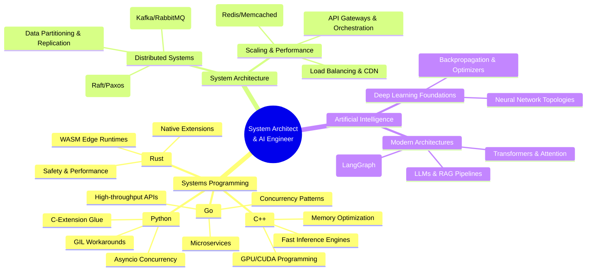

# Architect of Intelligence 🚀

Welcome to the ultimate curated resource repository and roadmap for becoming a hybrid **System Architect & AI Engineer**. 

Modern intelligent applications are no longer just model weights running in a sandbox; they are complex, high-throughput, low-latency distributed systems. To build, scale, and optimize these systems, one must master both **High-Performance System Architecture** and **AI/LLM System Design**.

---

## 🗺️ Core Pillars of Mastery

---

## 📂 Repository Index

*   [research_papers/](file:///Users/shridharkulkakrni/.gemini/antigravity-ide/scratch/architect-of-intelligence/research_papers/) - Foundational research papers that defined distributed systems and AI.
    *   [top_100_papers.md](file:///Users/shridharkulkakrni/.gemini/antigravity-ide/scratch/architect-of-intelligence/research_papers/top_100_papers.md) - **Top 100 AI Research Papers Catalog**.
    *   [neural_nets/](file:///Users/shridharkulkakrni/.gemini/antigravity-ide/scratch/architect-of-intelligence/research_papers/neural_nets/) - Neural networks, backprop, optimizations, and CNNs.
    *   [transformers/](file:///Users/shridharkulkakrni/.gemini/antigravity-ide/scratch/architect-of-intelligence/research_papers/transformers/) - Attention mechanisms, Transformers, and LLMs.
    *   [memory_rag/](file:///Users/shridharkulkakrni/.gemini/antigravity-ide/scratch/architect-of-intelligence/research_papers/memory_rag/) - Memory, dense retrieval, and RAG.
    *   [rl_agents/](file:///Users/shridharkulkakrni/.gemini/antigravity-ide/scratch/architect-of-intelligence/research_papers/rl_agents/) - Reinforcement learning, preference alignment, and autonomous agents.
*   [articles/](file:///Users/shridharkulkakrni/.gemini/antigravity-ide/scratch/architect-of-intelligence/articles/) - Deep-dives into key concepts.
    *   [README.md](file:///Users/shridharkulkakrni/.gemini/antigravity-ide/scratch/architect-of-intelligence/articles/README.md) - Subdirectory index.
    *   [distributed_systems.md](file:///Users/shridharkulkakrni/.gemini/antigravity-ide/scratch/architect-of-intelligence/articles/distributed_systems.md) - Consensus, replication, and data models.
    *   [neural_network_foundations.md](file:///Users/shridharkulkakrni/.gemini/antigravity-ide/scratch/architect-of-intelligence/articles/neural_network_foundations.md) - Deep learning backpropagation and optimization.
    *   [system_scaling.md](file:///Users/shridharkulkakrni/.gemini/antigravity-ide/scratch/architect-of-intelligence/articles/system_scaling.md) - Scaling databases, caching, and APIs.
    *   [multi_agent_design.md](file:///Users/shridharkulkakrni/.gemini/antigravity-ide/scratch/architect-of-intelligence/articles/multi_agent_design.md) - Multi-agent communication patterns and orchestration.
    *   [company_case_studies.md](file:///Users/shridharkulkakrni/.gemini/antigravity-ide/scratch/architect-of-intelligence/articles/company_case_studies.md) - Real-world company engineering scaling case studies.
*   [languages/](file:///Users/shridharkulkakrni/.gemini/antigravity-ide/scratch/architect-of-intelligence/languages/) - Guides and code patterns in systems languages.
    *   [README.md](file:///Users/shridharkulkakrni/.gemini/antigravity-ide/scratch/architect-of-intelligence/languages/README.md) - Subdirectory index.
    *   [python/](file:///Users/shridharkulkakrni/.gemini/antigravity-ide/scratch/architect-of-intelligence/languages/python/) - Concurrency, GIL bypass, memory generators, and AI bindings.
    *   [go/](file:///Users/shridharkulkakrni/.gemini/antigravity-ide/scratch/architect-of-intelligence/languages/go/) - Concurrency pipelines, channels, and microservices patterns.
    *   [cpp/](file:///Users/shridharkulkakrni/.gemini/antigravity-ide/scratch/architect-of-intelligence/languages/cpp/) - RAII, memory management, and AI inference optimization.
    *   [rust/](file:///Users/shridharkulkakrni/.gemini/antigravity-ide/scratch/architect-of-intelligence/languages/rust/) - Async Tokio runtimes, safety patterns, and WASM runtimes.

---

## 📚 Recommended Reading List

### 📊 Data Structures & Algorithms (DSA)
1.  **"Introduction to Algorithms"** (CLRS) by Thomas H. Cormen, Charles E. Leiserson, Ronald L. Rivest, and Clifford Stein (The comprehensive academic standard for algorithms).
2.  **"The Algorithm Design Manual"** by Steven S. Skiena (Excellent practical guide focusing on algorithm analysis and real-world designs).
3.  **"Algorithms"** by Robert Sedgewick and Kevin Wayne (Focuses on fundamental data structures and graph/string algorithms with Java).
4.  **"Grokking Algorithms"** by Aditya Bhargava (Highly visual, easy-to-understand introduction to core algorithms).

### 🏗️ System Architecture
1.  **"Designing Data-Intensive Applications"** by Martin Kleppmann (The bible of distributed databases, storage models, and scaling).
2.  **"System Design Interview – An Insider's Guide"** (Volumes 1 & 2) by Alex Xu (Excellent practical breakdowns of production services like web crawlers, chat apps, and Google Drive).
3.  **"Patterns of Enterprise Application Architecture"** by Martin Fowler (Classic design patterns for clean software architecture).

### 🧠 Artificial Intelligence
1.  **"Deep Learning"** by Ian Goodfellow, Yoshua Bengio, and Aaron Courville (Rigorous mathematical foundations of deep neural networks).
2.  **"Hands-On Machine Learning with Scikit-Learn, Keras, and TensorFlow"** by Aurélien Géron (Practical end-to-end guide to ML engineering).
3.  **"Build a Large Language Model (From Scratch)"** by Sebastian Raschka (Great step-by-step implementation guide to understand transformer internals).

### 💻 Systems Programming
*   **Python**: *"Fluent Python"* by Luciano Ramalho & *"High Performance Python"* by Micha Gorelick.
*   **Go**: *"The Go Programming Language"* by Alan A. A. Donovan & Brian W. Kernighan.
*   **C++**: *"Effective Modern C++"* by Scott Meyers.
*   **Rust**: *"Programming Rust: Fast, Safe Systems Development"* by Jim Blandy, Jason Orendorff, and Leonora F. S. Tindall.

---

## 📈 Suggested Learning Roadmap

### Phase 1: High-Performance Languages (Month 1-2)
*   Leverage **Python** for rapid prototyping, data pipeline design, and high-level AI modeling.
*   Master concurrency model in **Go** (goroutines/channels) for building quick, reliable APIs.
*   Learn memory models and safety guarantees in **Rust** (borrow checker, ownership) for writing robust system modules.
*   Understand RAII and performance tuning in **C++** for writing highly optimized AI inference engines.

### Phase 2: Distributed Systems Architecture (Month 3-4)
*   Learn how networks fail: Partitioning, CAP theorem, and PACELC theorem.
*   Master distributed consensus algorithms (**Raft/Paxos**).
*   Understand caching strategies, message queue backpressure, and load balancing algorithms.

### Phase 3: AI Engineering & Inference (Month 5-6)
*   Build a deep understanding of standard neural network architectures (MLPs, CNNs, Transformers).
*   Learn optimization techniques for serving AI models: quantization, pruning, TensorRT, and batching.
*   Build multi-agent designs and orchestrate memory models in LLM applications using stateful graphs.
