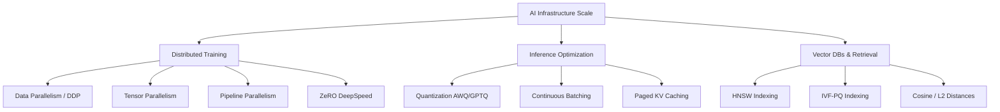

# AI Infrastructure & MLOps Scaling: Serving, Indexing, and Distributed Training 🚀🖥️

To bridge the gap between a standard system architect and a hybrid **System Architect + AI Engineer**, one must master **AI Infrastructure & MLOps at scale**. This article covers how models are trained across thousands of GPUs, served efficiently, indexed for semantic search, and monitored in production.

---

## 📐 AI Scale Pillars

---

## 1. Distributed Training Architectures

When a neural network contains billions of parameters (e.g., Llama-3 70B), it cannot fit into a single GPU's memory (VRAM). We must distribute training across multi-node GPU clusters.

### A. Data Parallelism (DDP)
*   **How it works**: The entire model is replicated on every GPU. The training dataset is split into shards. Each GPU processes its shard and calculates gradients. Gradients are then synchronized across all GPUs via an `AllReduce` network operation before updating the weights.
*   **Bottleneck**: Model size is still limited by a single GPU's VRAM.

### B. Tensor Parallelism (TP)
*   **How it works**: Splitting individual weight matrices of a single layer across multiple GPUs (e.g., column-parallel and row-parallel linear layers in Transformers).
*   **Bottleneck**: Requires extremely high-bandwidth inter-GPU connections (e.g., NVIDIA NVLink) because GPUs must sync activations on every forward/backward pass.

### C. Pipeline Parallelism (PP)
*   **How it works**: Splitting layers sequentially across different GPUs (e.g., layers 1-10 on GPU 1, layers 11-20 on GPU 2).
*   **Bottleneck**: "GPU Bubbles" (idle time) while GPU 2 waits for GPU 1 to finish. Solved using micro-batching scheduling (1F1B schedule).

### D. Zero Redundancy Optimizer (ZeRO)
*   **How it works**: Memory states (optimizer states, gradients, parameters) are partitioned across GPUs instead of replicated.
*   *ZeRO-1*: Partition optimizer states.
*   *ZeRO-2*: Partition optimizer states and gradients.
*   *ZeRO-3*: Partition optimizer states, gradients, and model parameters, swapping weights on-demand from CPU RAM or neighboring GPUs.

---

## 2. Serving & Inference Optimizations

In production, raw model inference is computationally expensive. Architects optimize serving engines (like vLLM or TensorRT-LLM) to handle high concurrency.

### A. Quantization
Reducing model weight precision from FP32/FP16 (16-bit) to INT8 or INT4 (8/4-bit).
*   **AWQ (Activation-aware Weight Quantization)**: Keeps the most critical 1% of weights in FP16 to prevent accuracy degradation, quantizing the remaining 99% to INT4.
*   **Benefit**: Reduces VRAM footprint by 4x, letting larger models run on cheaper GPU hardware (e.g., running a 70B model on a single node).

### B. KV Caching & PagedAttention
During generation, Transformers recalculate key-value (KV) states for past tokens, consuming massive memory.
*   **PagedAttention**: Stores KV cache items in non-contiguous physical VRAM memory blocks, mimicking operating system virtual memory page tables. This prevents fragmentation and increases concurrent request batch throughput.

### C. Continuous Batching
Relies on dynamic iteration-level scheduling to inject new requests into running inference batches, eliminating latency overheads caused by standard static batch queuing.

---

## 3. Vector Databases at Scale (Semantic Retrieval)

To feed contextual data into RAG workflows, we must index millions of vector embeddings (e.g., 1536-dimensional float arrays) and perform similarity searches in milliseconds.

### A. Hierarchical Navigable Small World (HNSW)
*   **How it works**: A multi-layer graph index where upper layers contain long-distance connections (quick navigation) and lower layers contain highly clustered neighbors (exact local search).
*   **Trade-off**: Extremely fast search latencies, but high RAM consumption to store the graph in-memory.

### B. Inverted File Index with Product Quantization (IVF-PQ)
*   **How it works**: IVF groups vectors into clusters (centroids) to restrict search spaces. Product Quantization (PQ) compresses vectors into small byte signatures, reducing storage requirements.
*   **Trade-off**: Low memory usage, but slightly lower retrieval recall accuracy.
