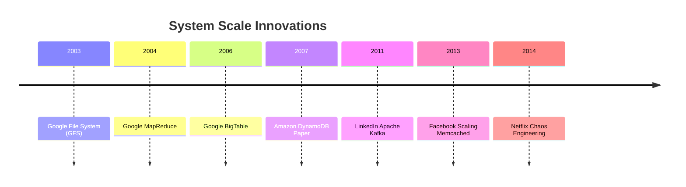

# Real-World Engineering Case Studies: Scaling to Millions of Users 🏢📈

How do top tech companies design systems, handle massive throughput, and invent new algorithms to solve scale bottlenecks? This article summarizes seminal case studies of distributed systems and algorithmic innovations in the industry.

---

## 🗺️ Seminal Case Studies Index

---

## 1. Google: Foundational Distributed Infrastructure

In the early 2000s, Google faced the challenge of indexing the entire web and running search queries across commodity hardware that frequently failed.

### A. The Google File System (GFS) (2003)
*   **Problem**: Need to store petabytes of data reliably across thousands of cheap, failing hard drives.
*   **Solution**: A master-worker architecture where files are divided into fixed-size **64MB chunks**. Chunks are replicated (default: 3x) across different Chunkservers. The Master node manages metadata and maps files to chunks in-memory.
*   **Impact**: Proved that software-level reliability could be built on top of unreliable hardware.

### B. MapReduce: Simplified Data Processing (2004)
*   **Problem**: How to perform massive parallel calculations (like PageRank) across thousands of servers without writing complex synchronization code.
*   **Solution**: An algorithmic model inspired by functional programming:
    1.  `Map`: Chunk inputs and process items in parallel (e.g., parse web pages and count words).
    2.  `Shuffle`: Group intermediate values by key.
    3.  `Reduce`: Aggregate grouped results in parallel.
*   **Impact**: Enabled developers to write parallel programs without managing concurrency, locking, or network failures.

---

## 2. Amazon: SLA-Driven DynamoDB (2007)

During holiday seasons, Amazon's shopping cart service could not afford downtime, even if network partitions occurred.

### A. The Dynamo Paper
*   **Problem**: Traditional relational databases could not scale write throughput horizontally or handle partitions without blocking.
*   **Solution**: A highly available, decentralized key-value store using:
    *   **Consistent Hashing**: A DHT (Distributed Hash Table) ring to partition keys across nodes with minimal redistribution when nodes join/leave.
    *   **Sloppy Quorums**: Accepting writes on healthy neighbor nodes when target nodes are unreachable.
    *   **Vector Clocks**: Tracking version histories to resolve concurrent write conflicts (e.g., multiple items added to shopping carts on separate network splits) asynchronously.
*   **Impact**: Formed the blueprint for Apache Cassandra and modern NoSQL databases.

---

## 3. LinkedIn: Apache Kafka (2011)

As LinkedIn grew, standard message queues (ActiveMQ, RabbitMQ) could not handle the massive volume of real-time user activity tracking and tracking metrics.

### A. Kafka Architecture
*   **Problem**: Traditional brokers parse message states (read/unread) in memory, causing disk bottlenecks.
*   **Solution**: A distributed commit log optimized for sequential I/O:
    *   Messages are written sequentially to an **append-only disk log**.
    *   Consumers maintain their own positions using an **offset counter**.
    *   Leverages the **Zero-Copy optimization** (passing pagecache data directly to the network socket, bypassing user-space copy operations).
*   **Impact**: Scaled event streaming to trillions of messages per day.

---

## 4. Facebook: Scaling Memcached (2013)

Facebook needed to serve billions of active users reading millions of social feed updates per second.

### A. Memcached Integration
*   **Problem**: Database read scaling bottlenecks.
*   **Solution**: Built a massive, multi-tiered cache-aside layer using Memcached:
    *   **Leases**: Prevented "thundering herds" (multiple clients querying the database simultaneously on a cache miss) by assigning a token to the first thread, forcing other threads to wait.
    *   **McRouter**: A routing layer acting as an API gateway for caching, splitting traffic geographically.
*   **Impact**: Allowed Facebook to serve billions of reads with sub-millisecond latencies.

---

## 5. Netflix: Chaos Engineering (2014)

When Netflix migrated its systems to AWS, it had to survive microservice failures gracefully.

### A. The Chaos Monkey
*   **Problem**: Engineers built resilient designs on paper, but production systems still failed when instances crashed.
*   **Solution**: Developed **Chaos Monkey**, a service running in production that randomly terminates EC2 instances. This forced engineers to design stateless services, automated failovers, and graceful degradation models (e.g., returning cached recommendations if the main personalization service fails).
*   **Impact**: Invented the field of Chaos Engineering.

---

## 6. Uber: Ringpop & Schemaless (2015-2016)

Uber needed to route trip coordinates in real-time between millions of active riders and drivers.

### A. Ringpop Gossip Protocol
*   **Problem**: Routing requests to specific driver-rider coordination instances in a cluster.
*   **Solution**: A Node.js library implementing a **Gossip Protocol** (SWIM) for membership list management, combined with **Consistent Hashing** to distribute rides to coordinate nodes efficiently.
*   **Impact**: Enabled real-time stateful connections with minimal database overhead.
