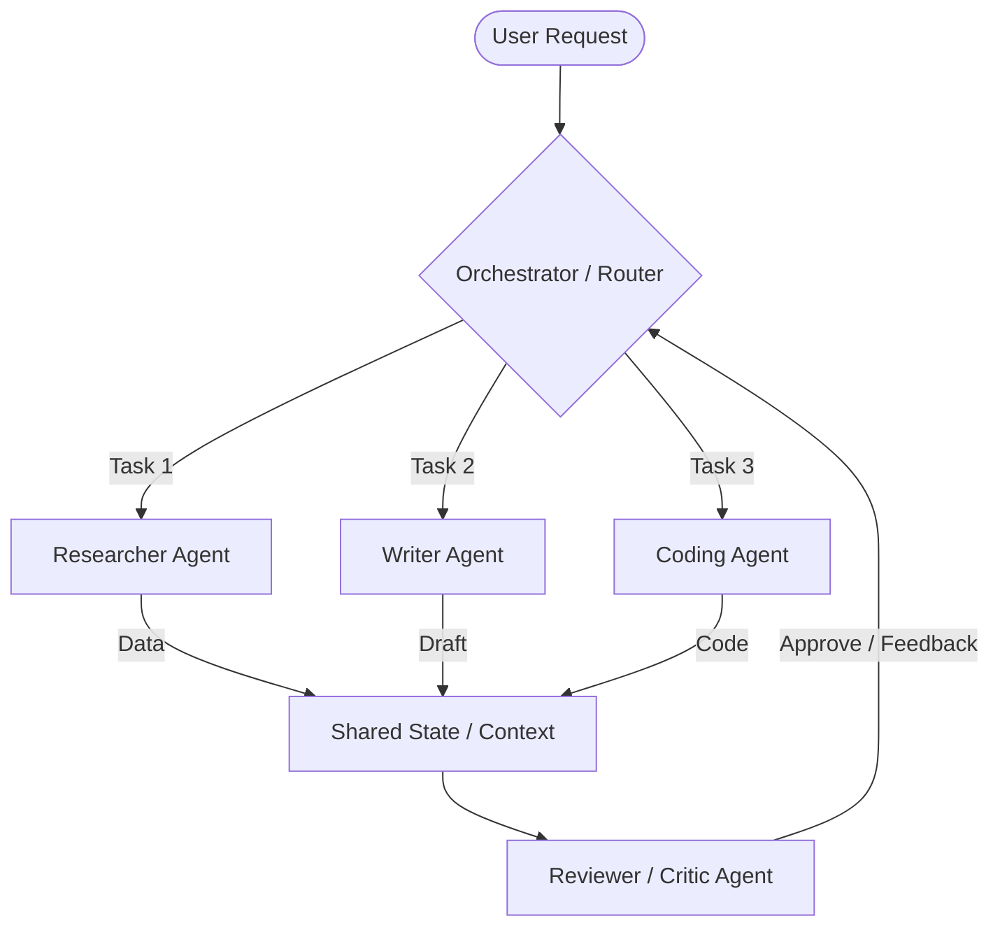

# Multi-Agent System Design 🤖🤝🤖

Multi-agent architectures divide complex goals into smaller, specialized subtasks handled by autonomous agents (e.g., Researcher, Writer, Coder, Critic). This modularity is essential for building robust AI systems that solve complex, multi-step problems.

---

## 🏗️ Core Architecture Patterns

### 1. Orchestrator-Worker (Hub & Spoke)
*   **How it works**: A central coordinator agent (the Orchestrator) receives the input, breaks it down, delegates subtasks to worker agents, and aggregates their results.
*   **Use case**: Automated code generation (Planner -> Coder -> Tester -> Aggregator).

### 2. Routing Agent (Classifier)
*   **How it works**: A lightweight agent inspects the user query and routes it to the single agent best suited to answer (e.g., routing a user query to either a "billing agent" or a "technical support agent").
*   **Use case**: Helpdesks, classifier frontends.

### 3. Choreography (Event-Driven Pipeline)
*   **How it works**: Agents execute sequentially without a central coordinator. The output of one agent automatically triggers the next.
*   **Use case**: Content generation pipelines (Researcher -> Writer -> Editor -> Publisher).

---

## 💾 State, Memory, and Tool Routing

For agents to coordinate successfully, they require:
1.  **Shared State**: A structured object (like a graph state or database entry) that all agents can read from and write to.
2.  **Memory**:
    *   **Short-term Memory**: The context window containing the current conversation history.
    *   **Long-term Memory**: Vector databases or profile stores to remember user preferences across sessions.
3.  **Tool Access**: Functions the agent can call to interact with the external world (e.g., database lookup, web search, file write).

---

## 🚀 Modern Multi-Agent Frameworks

To implement these designs, engineers use frameworks such as:
*   **LangGraph**: Combines agents into graphs (nodes and edges), supporting state persistence and cyclic loops (critical for correction loops).
*   **CrewAI**: Focuses on role-playing agents that collaborate on specific tasks.
*   **AutoGen**: Focuses on conversational, event-driven agent architectures.
